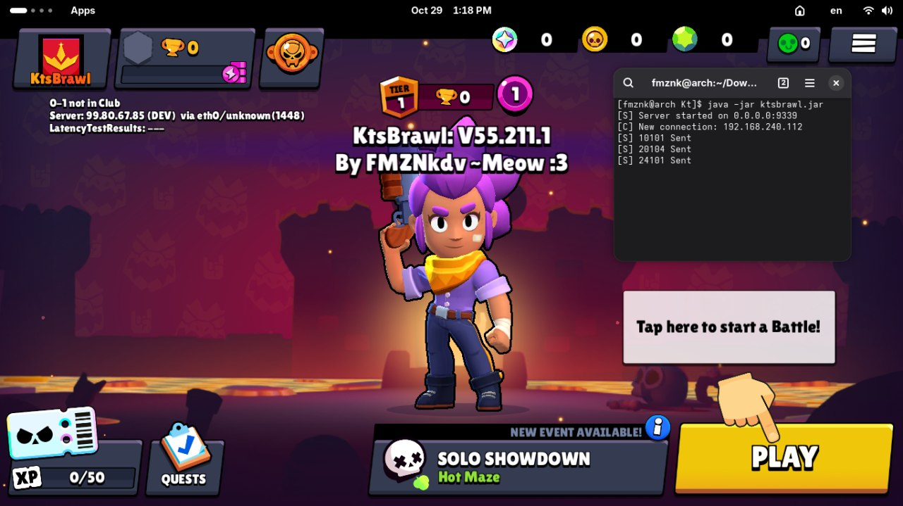

## KtsBrawl  

This is the Brawl Stars Core, version 55.211.1, written in Kotlin. This server emulates libg.so with minor server logic.

## Requirements

- Java 21 or higher
- Kotlin compiler (included in build)
- Brain..? 🧑🏿‍🦯

## Building

```bash
git clone https://github.com/FMZNkdv/KtsBtawl.git
cd KtsBrawl

kotlinc -include-runtime -d ktsbrawl.jar `find src -name "*.kt"`
```

## Running

```bash
java -jar ktsbrawl.jar
```

The server will start listening on `0.0.0.0:9339` by default.
